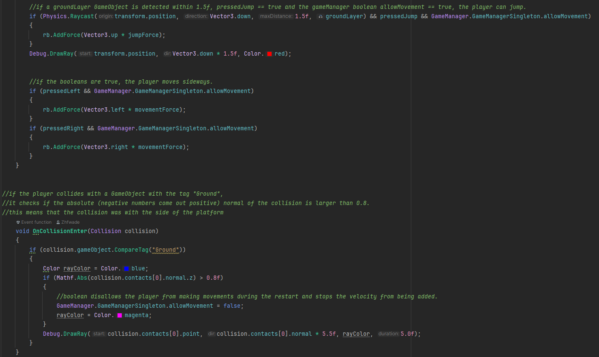

The game lets the player parkour through three different levels of difficulty until they fall off. The player can lose points or gain extra once by picking up the red and green orbs.

# Game Manager
The game has a gamemanager script that is declared a singleton and keeps track of the scores, updates the UI and respawns the player when they fall off.

# Level & Point spawning
The game instantiates 3 randomly choosen levels from an array and three baselevels in between evry 200 U.
Every time the z position of the player advances 200 U, the SpawnLevels method gets called.

The extra points also get instantiated from an array, but they only spawn above the parkourlevels, not the base levels.

# Player Movement
The game checks if the floor is within 1.5 U, if the player presses Space & if the gamemanager allows movement before the player can jump. If the player collides with the side of a level it tells the gamemanager to stop allowing movement, stopping the velocity and letting the player fall down.

# Performance
The game deletes the levels and the extra points once the player passes them. The scripts are written in a way that the game only checks for things when strictly neccesary.

[back](./)